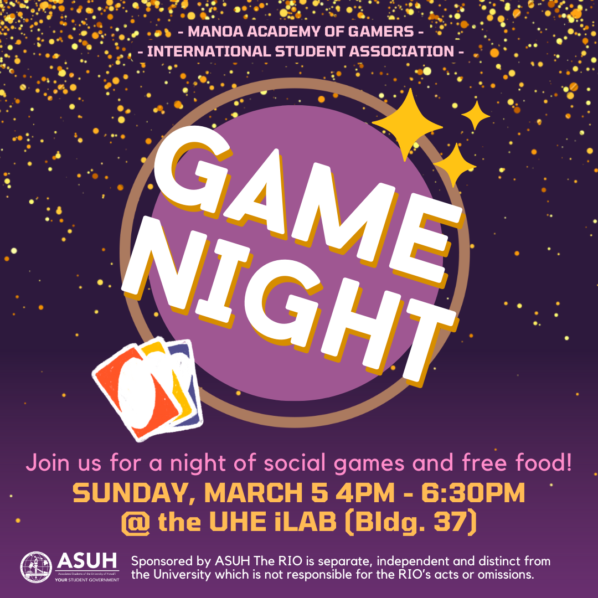
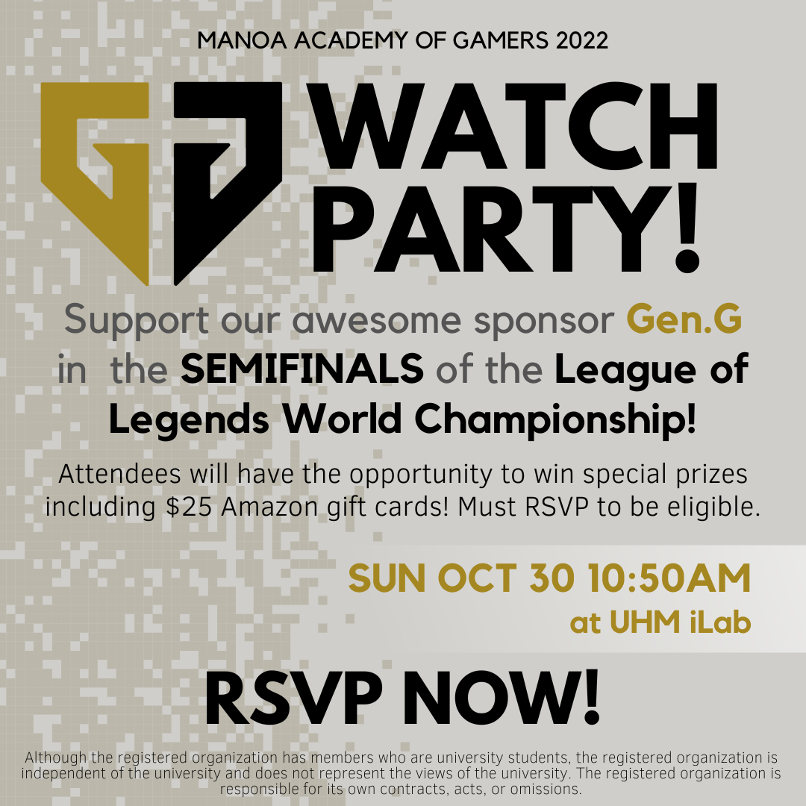
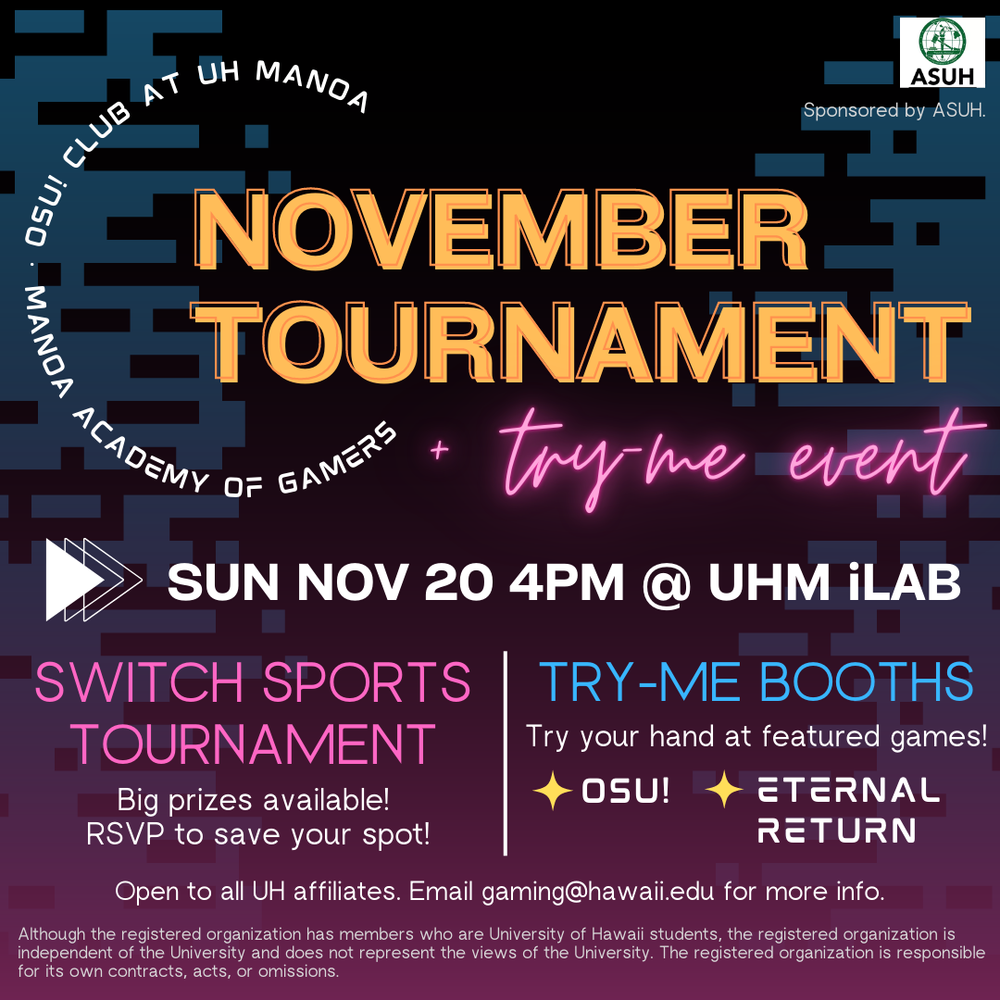
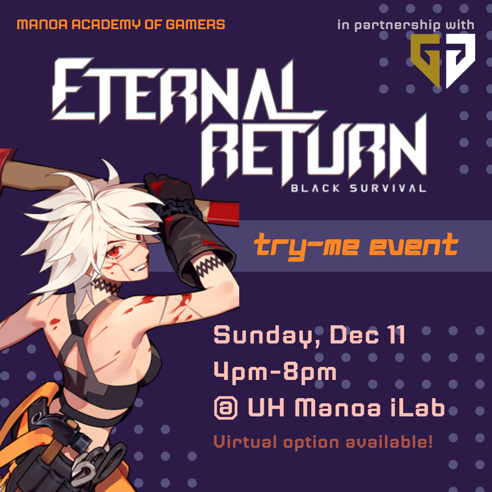

From Fall 2022, I served as the PR Officer for Manoa Academy of Gamers. As the PR Officer, I manage social media communications for the club in channels such as Discord, Instagram, and Twitter. I also create both print and digital flyers to advertise our events.

Source: <a href="https://www.instagram.com/manoaacademyofgamers/"><i class="large github icon "></i>Manoa Academy of Gamers Instagram</a>
