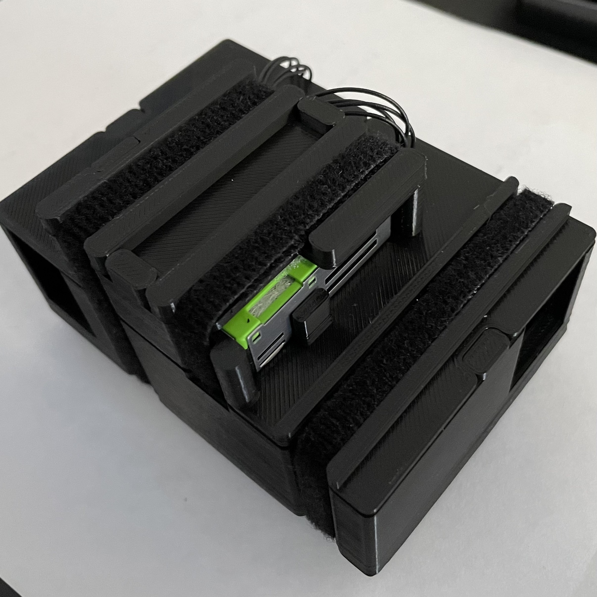
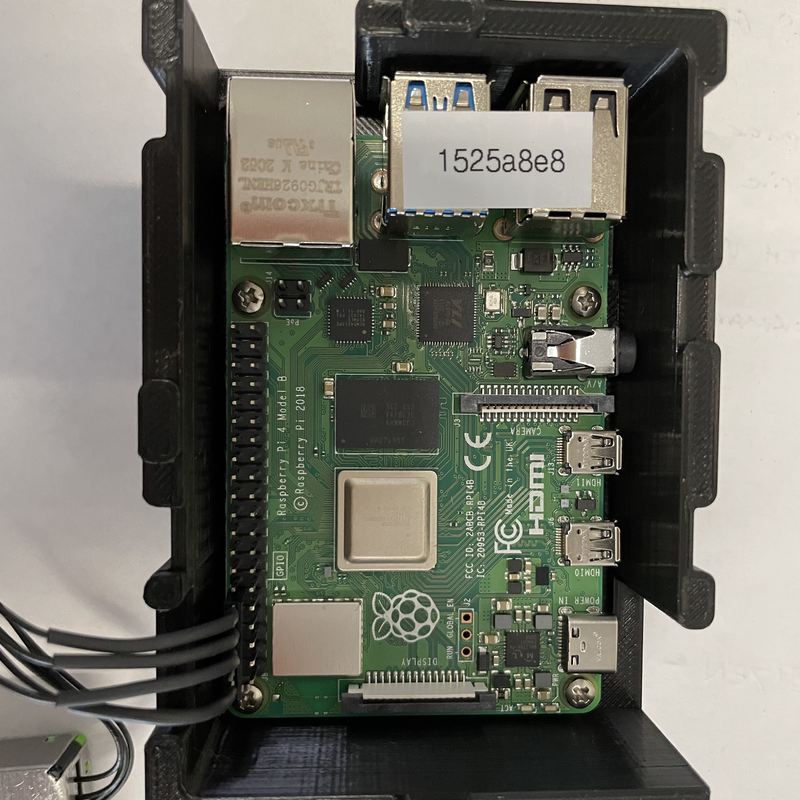
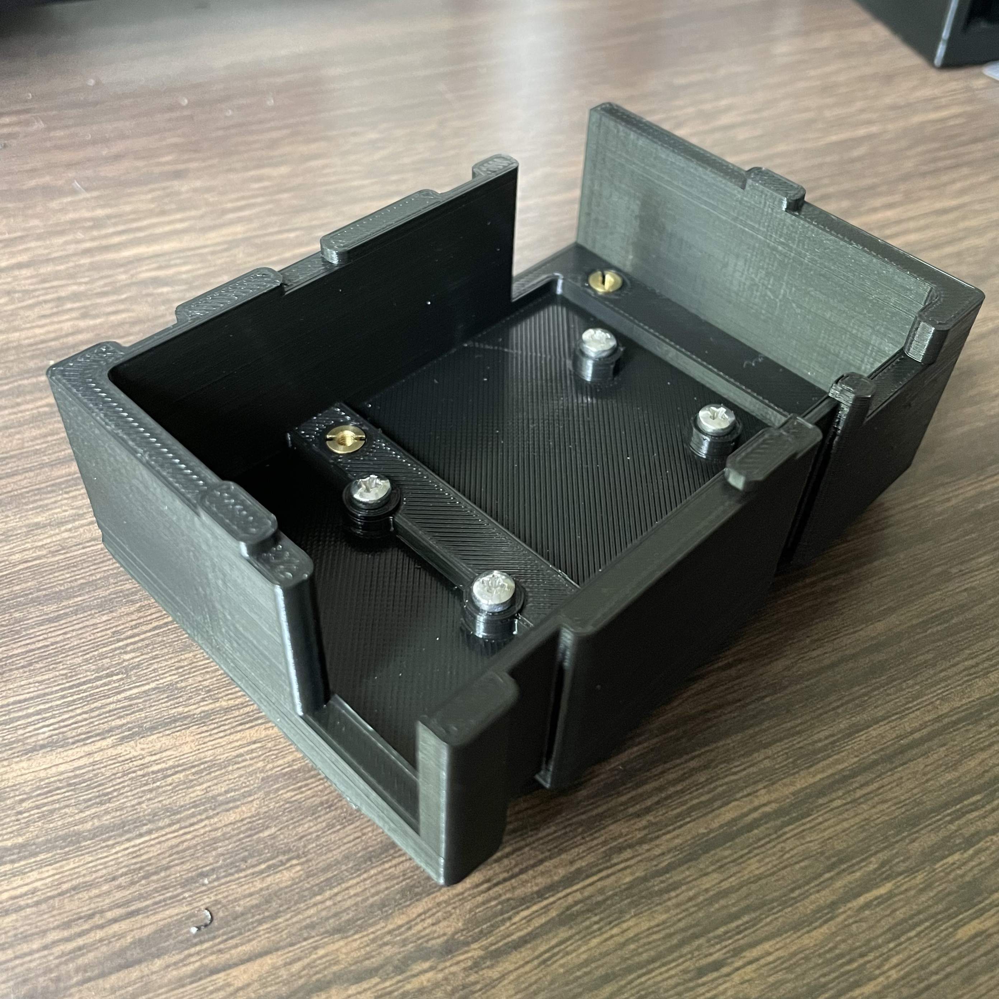
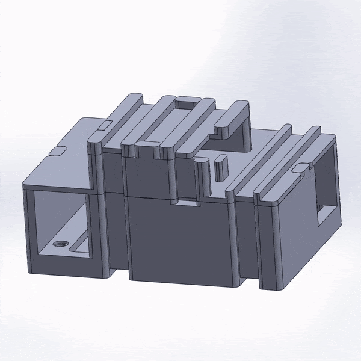

Determining air quality within telescope domes is invaluable to ensuring the health and cleanliness of the telescope mirror. Dust gathering on the mirror can affect observations and lead to noisy or inaccurate data. The purpose of this project was to fulfill the goal of monitoring air quality in the Canada-France-Hawaii Telescope dome by creating cases for the particle counters, which would be placed around different parts of the dome.

As a part of this project, I created several designs fulfilling the requirements of the case, then decided on one and presented it to the engineering team in a formal design review. I incorporated that feedback to make modifications to the Solidworks model, then 3D-printed samples. The final case was assembled with 3D-printed pieces, screws, velcro, and magnets. The cases were then tested for durability in the telescope dome.

The final design has three individual parts, as shown in the GIF: a large bottom piece holding the Raspberry Pi computer with holes for screws and magnets, a second-story lid serving as a base for the particle counter and to separate the particle counter and Raspberry Pi, and a topmost lid for the particle counter. Each piece was designed to minimize potential damage from exposed surfaces while still allowing for unobstructed data collection and access to all necessary ports. The three pieces were strapped together using hook and eye fastener. 

Source: <a href="../img/particlecounter/akamai-presentation.pdf"><i class="large github icon "></i>Akamai Internship Presentation</a>
