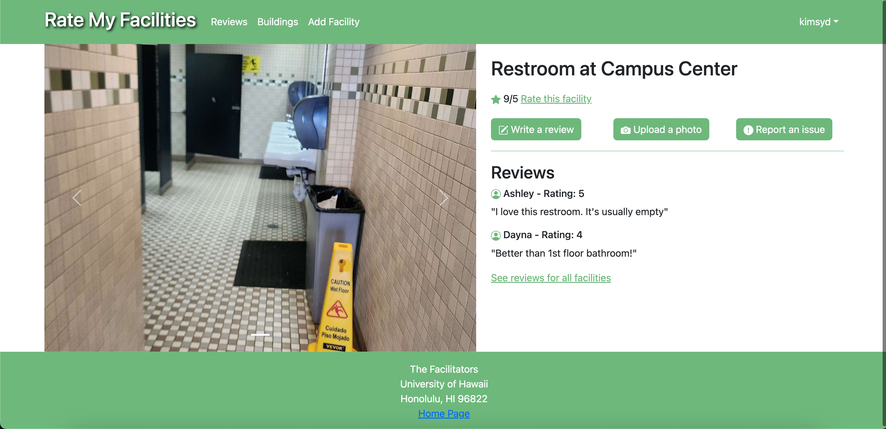

On our school campus, there are many facilities available for student use such as restrooms, water fountains, study spaces, and more. In highly-frequented areas, some of these facilities may become crowded, overused, or dirty faster than staff can keep up with. In these cases, it can be difficult for students to locate lesser-known facilites, especially in buildings or parts of campus they are not familiar with. The goal of our web application is to provide a rating forum that allows students to identify highly-rated facilities and rate facilities themselves.

Key features of this application include an email/password login system, standard user/admin account differentiation, the ability to see all facilities organized by building, the ability to add a facility, rate a facility and leave comments, view each facility's individual page with rankings and comments, and view ratings for all facilities.

As a member of this project team, I implemented several key features, such as the UI of each individual facility's page, the page generation and routing for each individual facility page, and the facilities data structure. 

An example of an individual facility's page. Ratings and comments are visible.

This experience allowed me to learn and practice app development with Meteor, the React and Bootstrap Javascript libraries, collaborative planning and teamwork, issue-driven project management, and Github for code sharing. This project provides a satisfactory solution for the common student struggle of not knowing the facilities available to us while also providing a rich learning experience.

The deployed site can be viewed here: <a href="https://ratemyfacilities.me/">Rate My Facilities.</a>

The project site displaying screenshots of each page, milestone information, and developer instructions can be viewed here: <a href="https://d-facilitators.github.io/">RMF Project Site.</a>

This project was a collaborative effort among the following authors: Silvia De Benedictis, Joshua Galeria, Urban Halpern, Sydney Kim, Wilson Tran.
